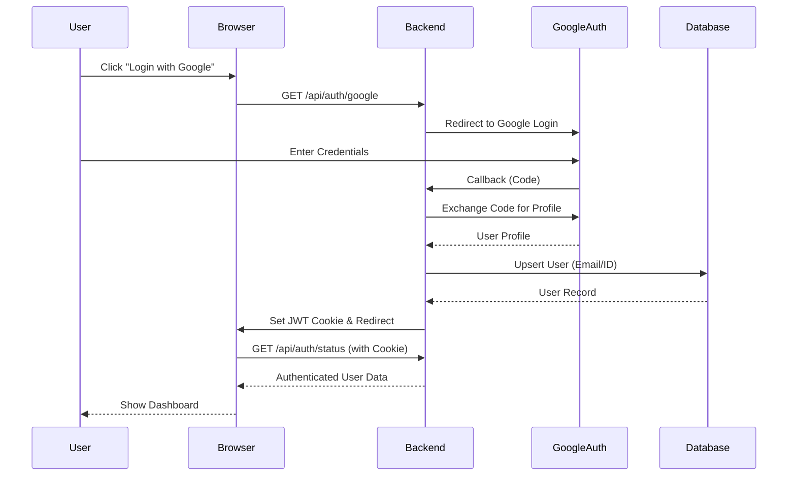
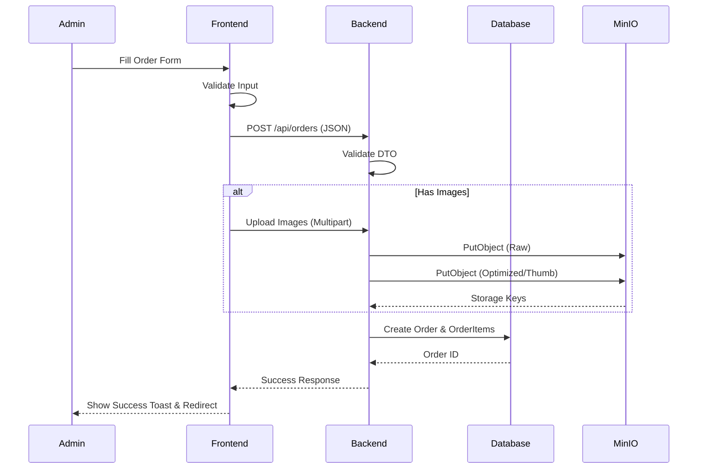
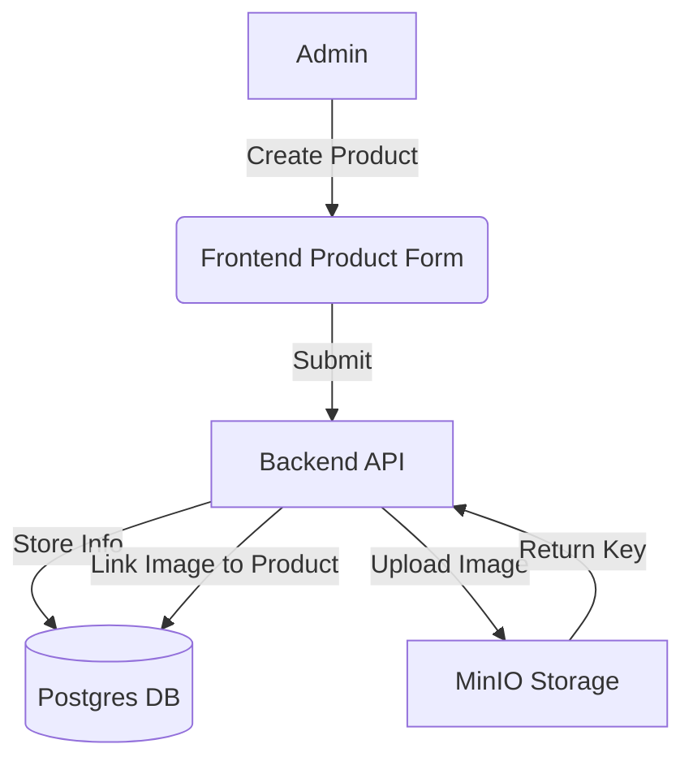
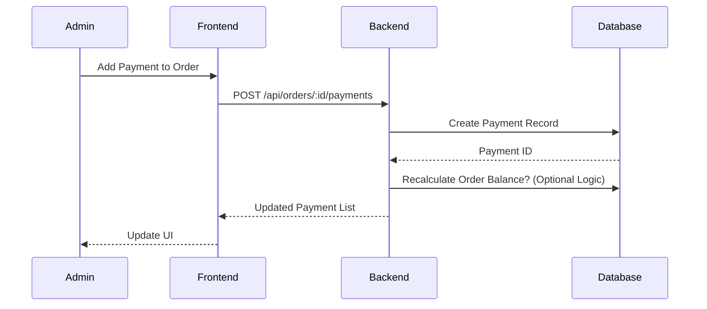

# Zenkar Platform - Dataflow Diagrams

This document visualizes the data flow for critical processes within the Zenkar Platform.

## 1. Authentication Flow (Google OAuth)

## 2. Order Creation Flow

## 3. Product Management

## 4. Payment Flow

