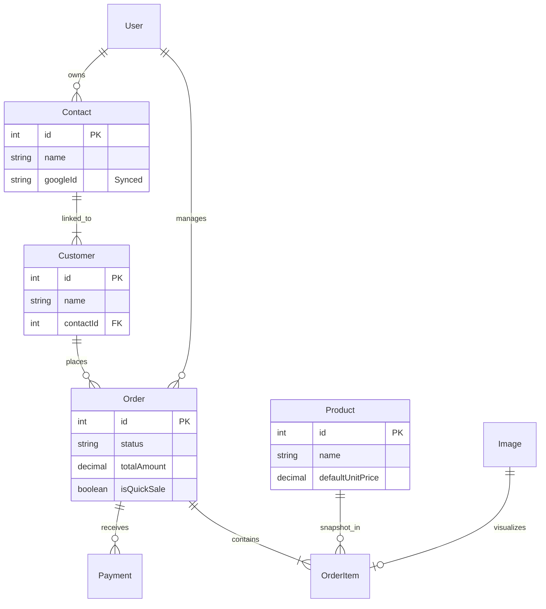
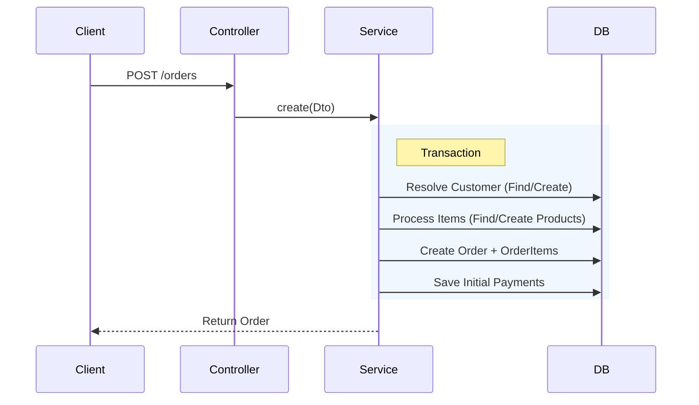
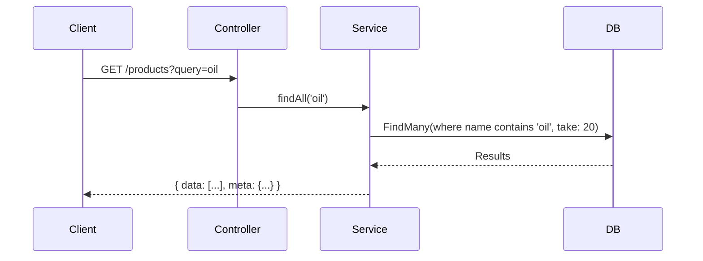
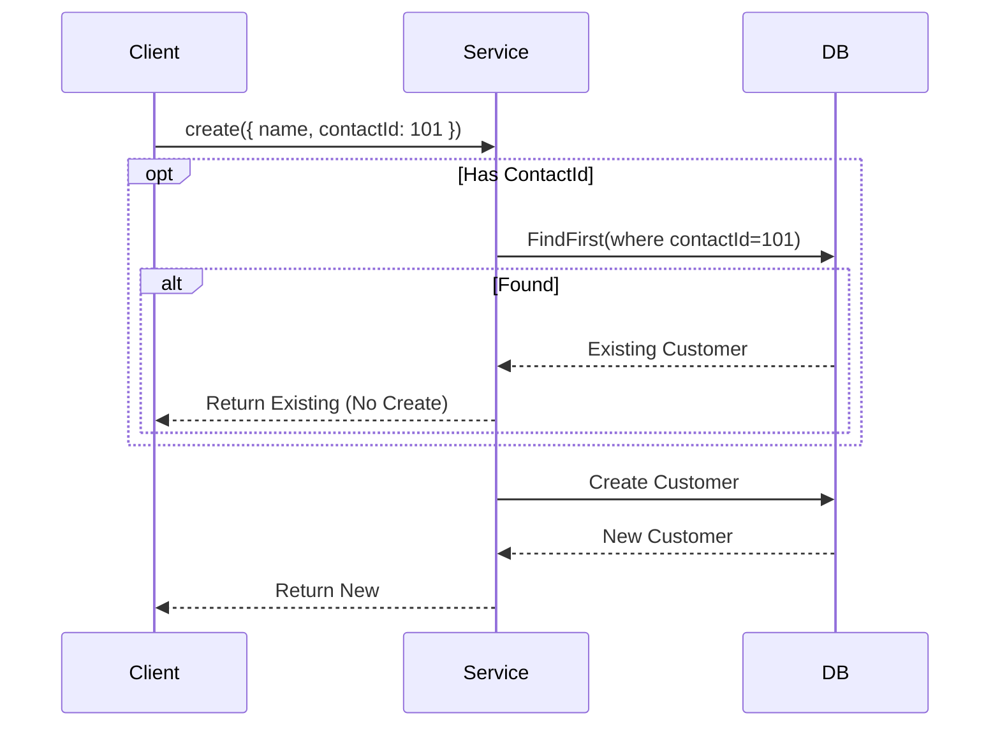
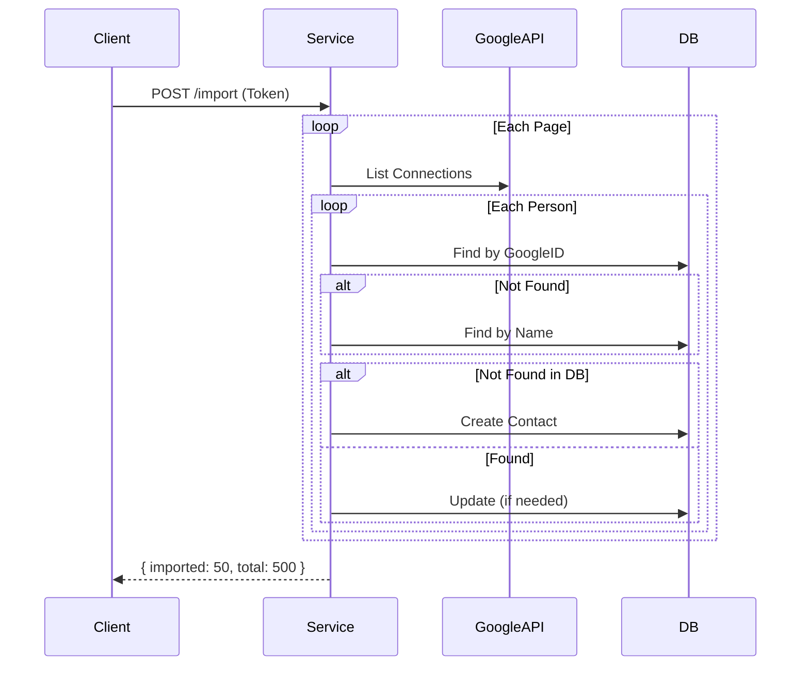
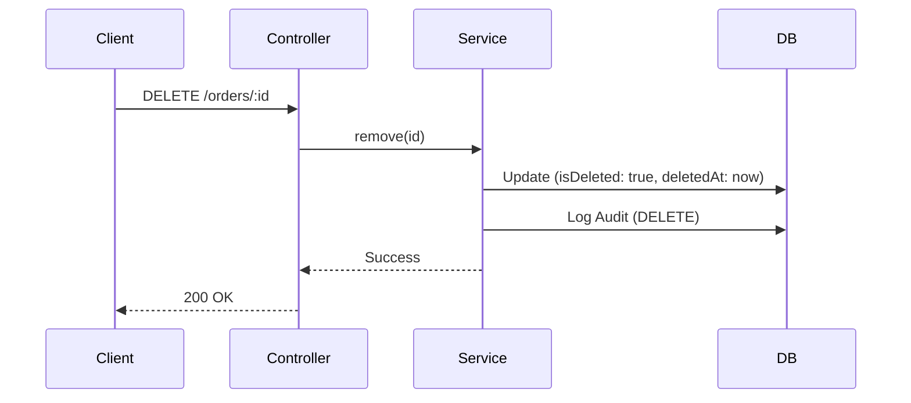
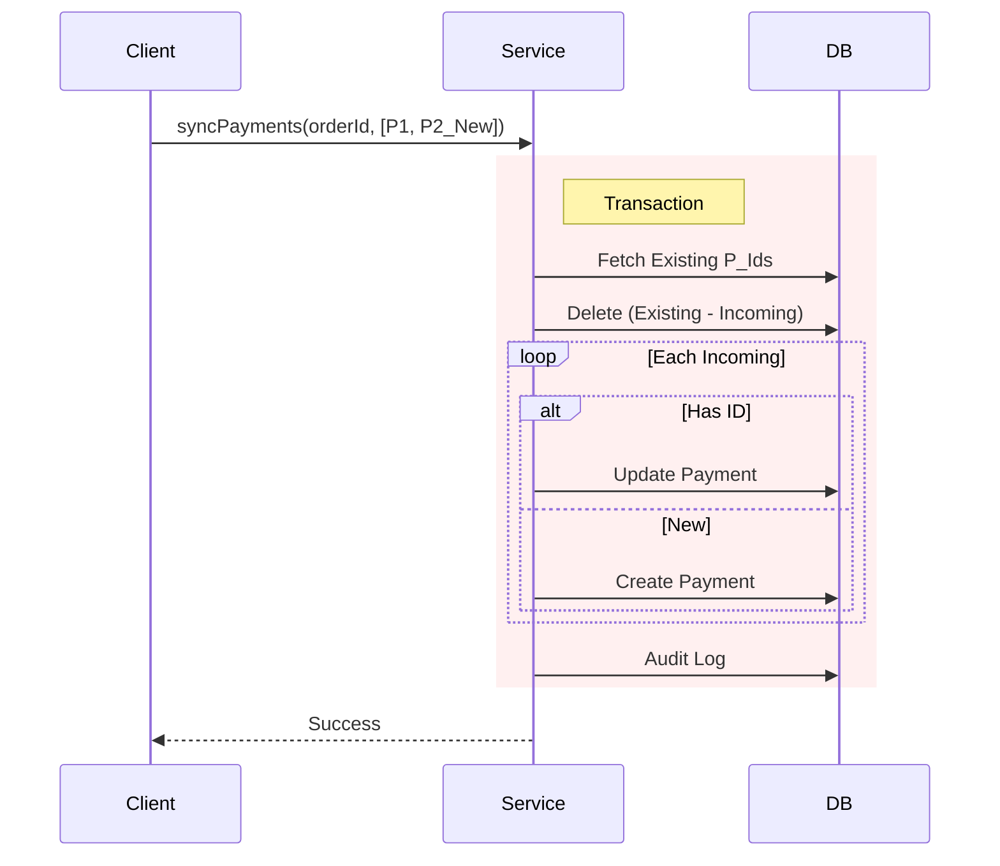

# Zenkar Platform - API & System Documentation

This document provides a comprehensive overview of the core modules: Orders, Products, Customers, Contacts, and Payments.

## 1. Database Schema Overview

The system centers around `Order` processing, supported by `Product` inventory, `Customer` management, and `Contact` books.

---

## 2. Orders Module

### API Endpoints
| Method | Endpoint | Description | Key Params |
| :--- | :--- | :--- | :--- |
| `POST` | `/orders` | Create Order | `items`, `customerId` (or `customerName`) |
| `GET` | `/orders` | List Orders | `view=active/history`, `page`, `limit` |
| `GET` | `/orders/:id` | Get Details | `id` |
| `PATCH` | `/orders/:id` | Update Order | `status`, `items`, `payments` |
| `POST` | `/orders/:id/payments` | Add Payment | `amount`, `date` |

### Key Logic
- **Walk-in Handling**: If `customerId` is missing during Quick Sale, assigns to "Walk-In" customer.
- **Auto-Product Creation**: If `items` contain new names, products are created on the fly.
- **Payment Calculation**: `paidAmount` is sum of related `payments`. `balance` is `total - paid`.

### Data Flow: Create Order

---

## 3. Products Module

### API Endpoints
| Method | Endpoint | Description | Payload / Params |
| :--- | :--- | :--- | :--- |
| `POST` | `/products` | Create Product | `{ name, defaultUnitPrice }` |
| `GET` | `/products` | List / Search | `query` (name search), `page`, `limit` |
| `GET` | `/products/:id` | Get Details | `id` |
| `PATCH` | `/products/:id` | Update | `{ name, defaultUnitPrice }` |
| `DELETE` | `/products/:id` | Soft Delete | `id` |

### Logic
- **Soft Delete**: Products are never hard deleted to preserve Order History integrity. They are marked `isDeleted: true`.
- **Search**: Case-insensitive substring match on `name`.

### Data Flow: Product Search

---

## 4. Customers Module

### API Endpoints
| Method | Endpoint | Description | Key Params |
| :--- | :--- | :--- | :--- |
| `POST` | `/customers` | Create Customer | `{ name, phone, contactId? }` |
| `GET` | `/customers` | Search | `query` (name/phone), `page` |
| `GET` | `/customers/:id` | Get Details | `id` |
| `PATCH` | `/customers/:id` | Update | `{ name, phone }` |
| `DELETE` | `/customers/:id` | Delete | `id` |

### Logic: Smart Selector & Contact Linking
- **Contact Linking**: Customers can be linked to a `Contact` (from Google/Phonebook).
- **Deduplication**: If creating a customer with a `contactId`, the system checks if a customer for that `userId` + `contactId` already exists. If so, it returns the existing one instead of creating a duplicate.

### Data Flow: Create Customer (Smart Check)

---

## 5. Contacts Module

### API Endpoints
| Method | Endpoint | Description | Key Params |
| :--- | :--- | :--- | :--- |
| `POST` | `/contacts` | Create Contact | `{ name, phone }` |
| `GET` | `/contacts` | List All | `userId` (optional filter) |
| `PATCH` | `/contacts/:id` | Update | `{ name, phone }` |
| `DELETE` | `/contacts/:id` | Delete | `id` |
| `POST` | `/contacts/import`| Import from Google | `{ accessToken }` |

### Logic: Google Import Strategy
The import process is robust and handles duplicates:
1.  **Fetch**: Iterates through Google People API specific pages.
2.  **Match Strategy**:
    *   **Priority 1**: Match by `googleId` (Stable ID).
    *   **Priority 2**: Match by `name` (Legacy fallback).
3.  **Action**:
    *   **Found**: Update metadata (e.g. link `googleId` if missing).
    *   **Not Found**: Create new Contact.
    *   **Result**: Returns count of imported vs found.

### Data Flow: Google Import

---

### 4.6 Delete Order Flow (`DELETE /:id`)

---

## 5. Dashboard Module (Reporting)

### API Endpoints
| Method | Endpoint | Description | Query Params |
| :--- | :--- | :--- | :--- |
| `GET` | `/dashboard/stats` | Aggregated stats | `date` |
| `GET` | `/dashboard/payments` | List payments for date | `date` |
| `GET` | `/dashboard/activities` | Recent audit logs | - |

### Logic
- **Stats**: Aggregates total sales, received amounts, and expenses for a specific date.
- **Payments View**: `GET /dashboard/payments` provides a flattened list of all payments received on a given date (across all orders), which is essential for the "Day Book" view.

---

## 6. Payments Logic

Payments are primarily sub-resources of Orders, but they have their own comprehensive handling.

### Key Concepts
- **Order Payments**: Managed via `/orders/:id/payments`.
- **Global View**: Managed via `/dashboard/payments` (See Dashboard).
- **Sync Logic**: The `syncPayments` endpoint allows full replacement of payment history.

### Data Flow: Sync Payments

